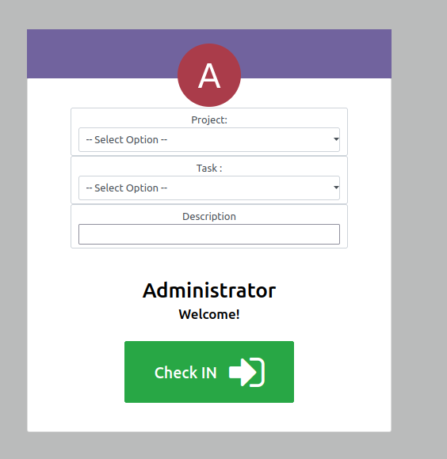
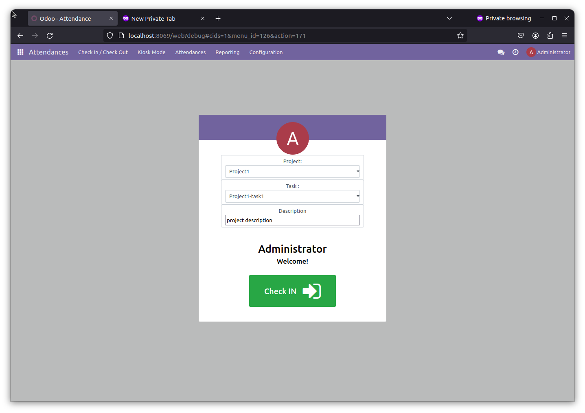
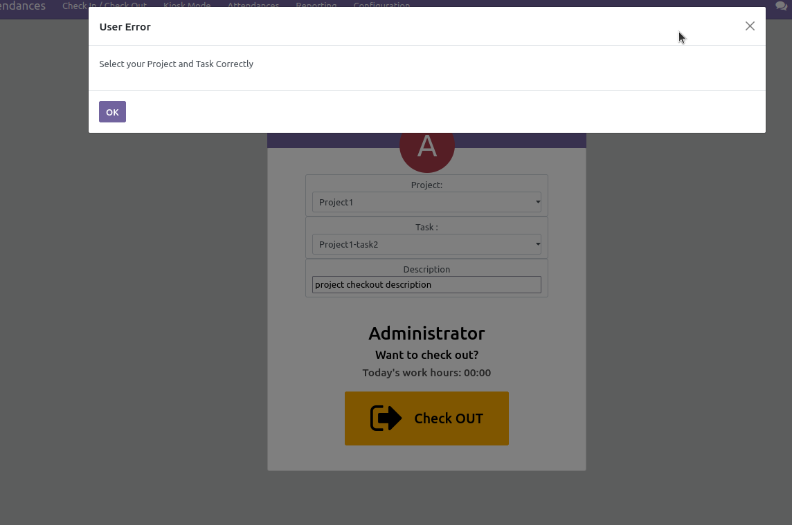
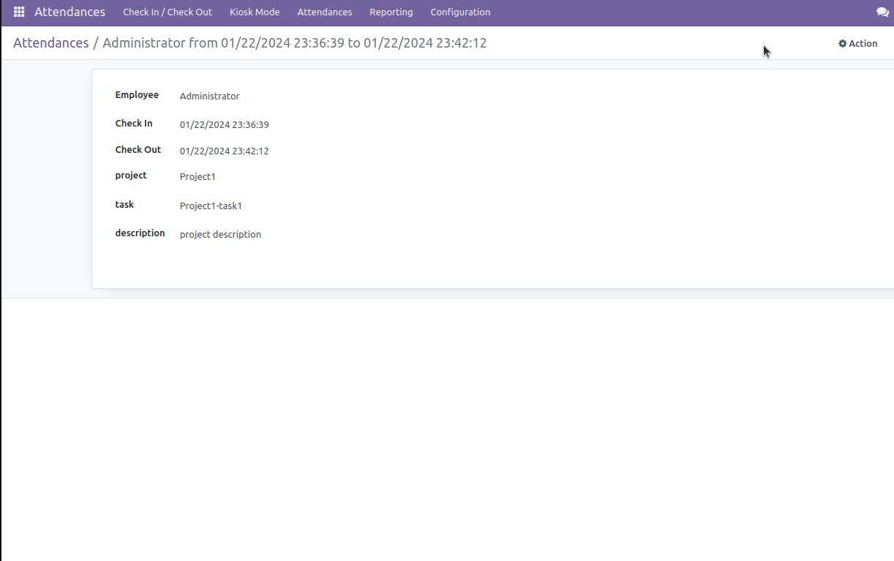

## Problem Statement 
- Modify the check-in/check-out screen to include dropdown menus or selection fields for projects and tasks.
- Ensure that the project and task fields are dynamically linked (selecting a project should filter the available tasks related to it).
- Provide a text box for entering descriptions.

## How to work Flow-User Documention
- Checkin/checkout screen update project,task,description 

- selecting a project, users  able to select a specific task related to the chosen project!

- Validating project and task on checkout

-To store the additional information: project, task, and descriptions.

## Things to improve

1. Add project detail to timesheet
2. Filter project and task based on user

